# Android Job Interview Preparation - Video Library

A curated list of helpful videos for preparing for Android job interviews.

If you have or know of any Android job interview videos on YouTube, please send me the link: https://forms.gle/2xKMf8eaq4MWqvFq9

## Table of Contents

*   [Russian Videos](#russian-videos)
*   [English Videos](#english-videos)
*   [Other materials](#materials)

## Russian Videos 

1.  [Feb 24, 2025 SENIOR ANDROID мок-интервью полная теория | Kotlin/Java | Android | Coroutines | System Design](#russian1)
2.  [Feb 9, 2025 Собеседование Junior Android](#russian2)
3.  [Feb 11, 2025 Tech Talk & Тестовое собеседование Junior Android разработчика ](#russian3)
4.  [Feb 20, 2025 Мок собеседование Android разработчика в Контур: архитектура и кодинг приложения](#russian4)
5.  [Oct 9, 2024 Публичное собеседование с X5 Tech: Android-разработчик](#russian5)
6.  [Mar 10, 2024 Собеседование по Kotlin. Проводит Кирилл Розов](#russian6)
7.  [Feb 5, 2025 Разбор задач в Wildberries на 600к / Собеседование Android](#russian7)
8.  [Mar 21, 2024 Собеседование на Mobile Developer. Сергей Ермолаев, Авито](#russian8)
9.  [Apr 19, 2023 Публичное собеседование Android-разработчика с компанией Магнит](#russian9)
10. [Sep 8, 2023 Cобеседование Android-разработчика. Максим Качинкин, Dodo Engineering](#russian10)
11. [Sep 22, 2023 Собеседование на Mobile Developer. Алексей Панов, Контур](#russian11)
12. [Nov 20, 2021 Android Junior Interview Собеседование на позицию андроид джуниор разработчик. 2021 год. EasyCodeRu](#russian12)
13. [Nov 1, 2023 Собеседование с Михаилом Левченко](#russian13)
14. [Jan 20, 2024 Мок-собеседование Junior Android developer](#russian14)
15. [Mar 12, 2025 #FaangTalk 77 - Android System Design](#russian15)
16. [Aug 26, 2022 Экспертное собеседование на позицию Senior Android разработчика](#russian16)
17. [Архитектурное собеседование Android разработчика в формате гемблинга!](#russian17)

## English Videos 

1.  [Jun 17, 2024 Technical Interview for Mobile Developer](#english1)
2.  [Jun 17, 2024 Technical Interview for Mobile Developer](#english2)
3.  [Nov 11, 2022 REAL ANDROID DEVELOPER INTERVIEW](#english3)
4.  [Nov 18, 2022 SYSTEM DESIGN INTERVIEW - ANDROID DEVELOPMENT](#english4)
5.  [Mar 19, 2022 Learn about Android Technical Phone Screen at LinkedIn](#english5)

## Other materials 
1. база знаний: https://michaelbel.notion.site/ANDROID-CAREER-689a0c8ce744419f8f53446e5e68e8f1
2. база знаний: https://iartr.notion.site/
3. вопросы: https://github.com/amitshekhariitbhu/android-interview-questions
4. вопросы: https://nurlandroid.com/?p=615
5. вопросы-ответы: https://github.com/Senchick/android-interview
6. вопросы-ответы: https://cactus-dev.notion.site/e71fb7b5652a4be39c5fe305a6521247
7. вопросы: https://docs.google.com/document/d/1AyBQJPcR12kEvWgSBt1pX8czp6QsYLfOoCq5tPtsIpA/edit?tab=t.0#heading=h.s3iof9ife815
8. вопросы: https://docs.google.com/spreadsheets/d/1DRiPl3bWVkNurPw3oKjb4HLtld5g5jM8tSQppFvbA9c/edit?usp=sharing
9. system design: https://github.com/iartr/mobile-system-design
10. system design: https://github.com/weeeBox/mobile-system-design

---

## Russian 

### [Feb 24, 2025 SENIOR ANDROID мок-интервью полная теория | Kotlin/Java | Android | Coroutines | System Design](https://www.youtube.com/watch?v=MgWUtFK8TLA) 

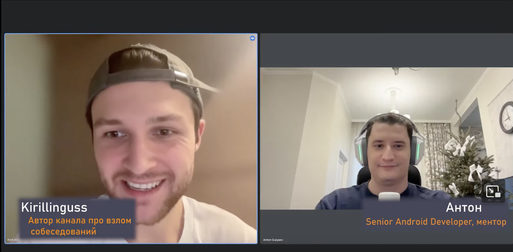

*   [Back to list](#russian-videos)

---

### [Feb 9, 2025 Собеседование Junior Android](https://www.youtube.com/watch?v=Rg0H1dQem0w) 

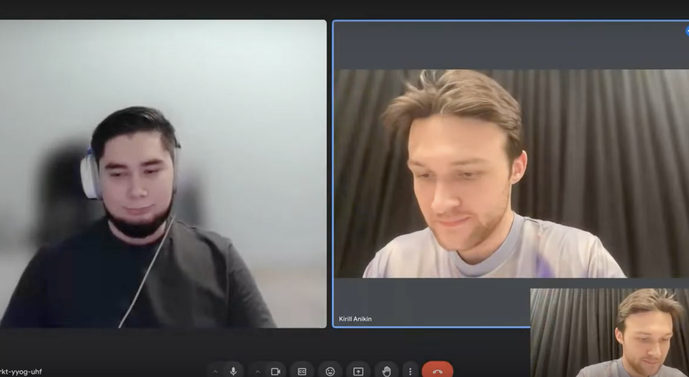

*   [Back to list](#russian-videos)

---
### [Feb 11, 2025 Tech Talk & Тестовое собеседование Junior Android разработчика ](https://www.youtube.com/watch?v=ShLN_VZlIKU) 

*   [Back to list](#russian-videos)

---
### [Feb 20, 2025 Мок собеседование Android разработчика в Контур: архитектура и кодинг приложения](https://www.youtube.com/watch?v=KY0uBfEkTho) 

*   [Back to list](#russian-videos)

---
### [Oct 9, 2024 Публичное собеседование с X5 Tech: Android-разработчик](https://www.youtube.com/watch?v=pXnKTHKrgf0) 

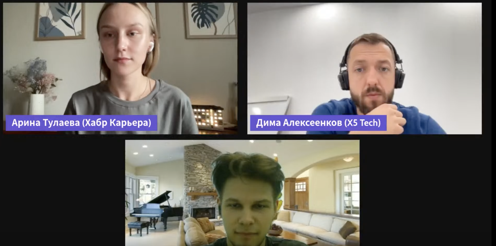

*   [Back to list](#russian-videos)

---
### [Mar 10, 2024 Собеседование по Kotlin. Проводит Кирилл Розов](https://www.youtube.com/watch?v=62XBpj2hrQw) 

*   [Back to list](#russian-videos)

---
### [Feb 5, 2025 Разбор задач в Wildberries на 600к / Собеседование Android](https://www.youtube.com/watch?v=vSHqR8W6-pY) 

*   [Back to list](#russian-videos)

---
### [Mar 21, 2024 Собеседование на Mobile Developer. Сергей Ермолаев, Авито](https://www.youtube.com/watch?v=B9zOXjtHY7Q) 

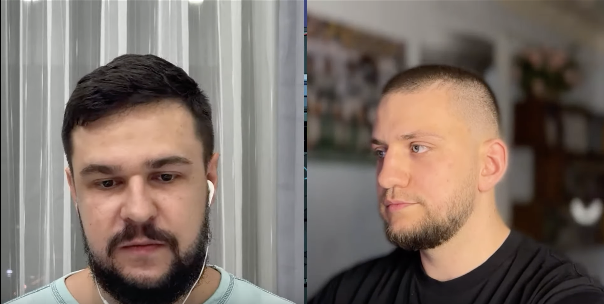

*   [Back to list](#russian-videos)

---
### [Apr 19, 2023 Публичное собеседование Android-разработчика с компанией Магнит](https://www.youtube.com/watch?v=6pEb4ihnXo0) 

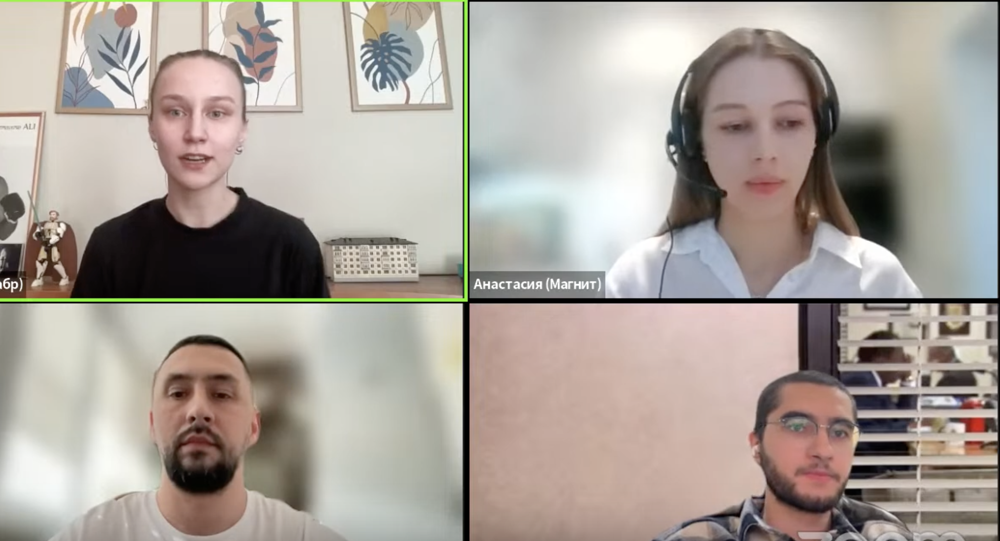

*   [Back to list](#russian-videos)

---
### [Sep 8, 2023 Cобеседование Android-разработчика. Максим Качинкин, Dodo Engineering](https://www.youtube.com/watch?v=4Mkrk3YDuCw) 

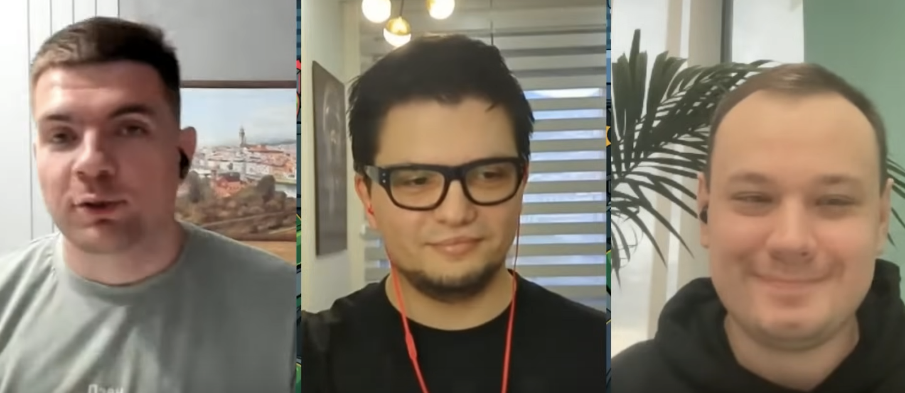

*   [Back to list](#russian-videos)

---
### [Sep 22, 2023 Собеседование на Mobile Developer. Алексей Панов, Контур](https://www.youtube.com/watch?v=i45sp7O_RUc) 

*   [Back to list](#russian-videos)

---
### [Nov 20, 2021 Android Junior Interview Собеседование на позицию андроид джуниор разработчик. 2021 год. EasyCodeRu](https://www.youtube.com/watch?v=M4rXGptuEWQ) 

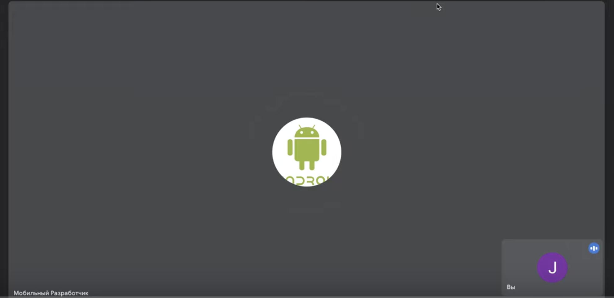

*   [Back to list](#russian-videos)

---
### [Nov 1, 2023 Собеседование с Михаилом Левченко](https://www.youtube.com/watch?v=d4iq9-ZxqCw) 

*   [Back to list](#russian-videos)

---
### [Jan 20, 2024 Мок-собеседование Junior Android developer](https://www.youtube.com/watch?v=3pZ-gHRr-LY) 

*   [Back to list](#russian-videos)

---
### [Mar 12, 2025 #FaangTalk 77 - Android System Design](https://www.youtube.com/watch?v=MYwAJQF9lOw) 

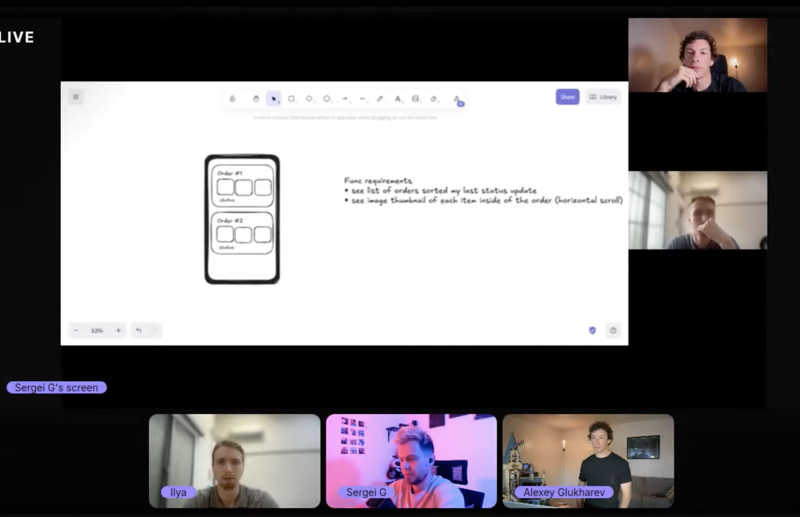

*   [Back to list](#russian-videos)

---
### [Aug 26, 2022 Экспертное собеседование на позицию Senior Android разработчика](https://www.youtube.com/watch?v=61aFEG97GrE) 

*   [Back to list](#russian-videos)

---
### [Архитектурное собеседование Android разработчика в формате гемблинга!](https://www.youtube.com/watch?v=gP2zf6wAIZ4) 

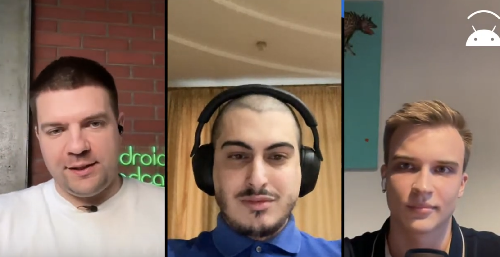

*   [Back to list](#russian-videos)

---
## English

### [Jun 17, 2024 Technical Interview for Mobile Developer](https://www.youtube.com/watch?v=O7AZATJ3PXM) 

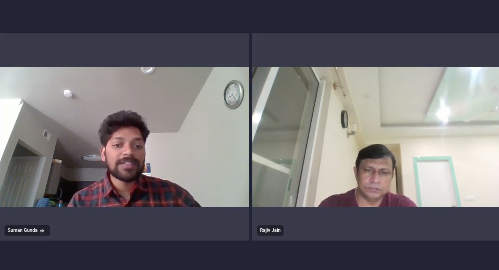

*   [Back to list](#english-videos)

---
### [Jun 17, 2024 Technical Interview for Mobile Developer](https://www.youtube.com/watch?v=K-ngofj1vFQ) 

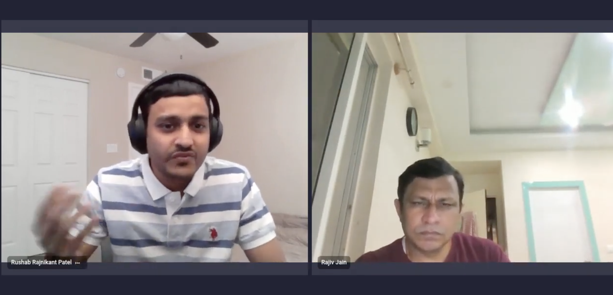

*   [Back to list](#english-videos)

---
### [Nov 11, 2022 REAL ANDROID DEVELOPER INTERVIEW](https://www.youtube.com/watch?v=8OPPk-eEcfQ) 

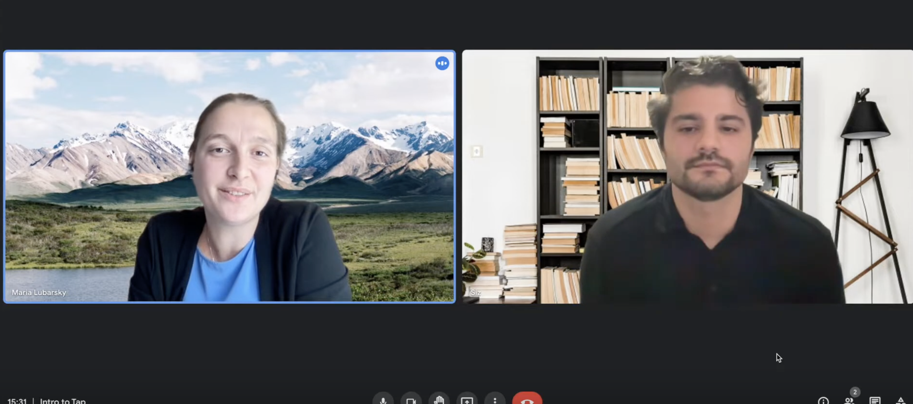

*   [Back to list](#english-videos)

---
### [Nov 18, 2022 SYSTEM DESIGN INTERVIEW - ANDROID DEVELOPMENT](https://www.youtube.com/watch?v=qNOtBuqLbEM) 

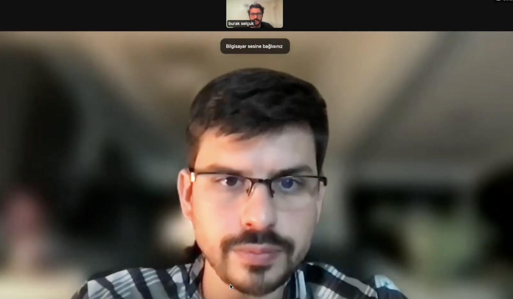

*   [Back to list](#english-videos)

---
### [Mar 19, 2022 Learn about Android Technical Phone Screen at LinkedIn](https://www.youtube.com/watch?v=WyhkX_oZVAw) 

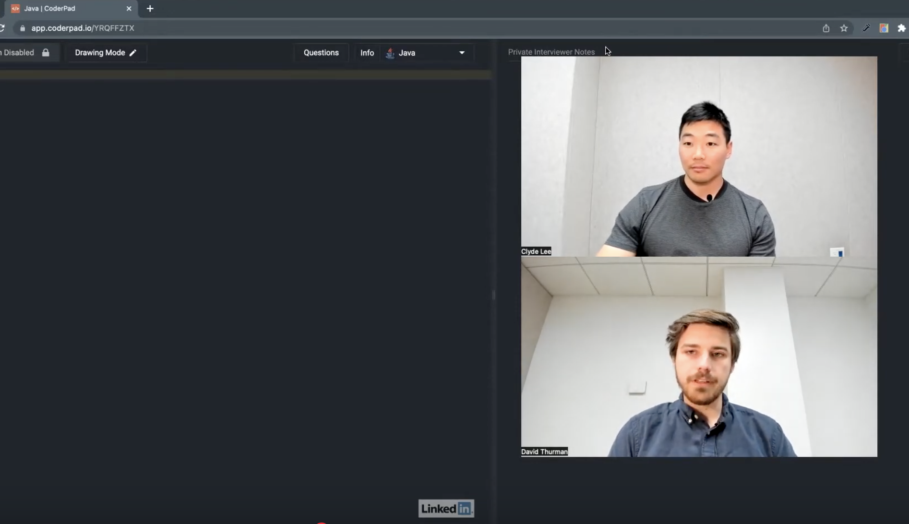

*   [Back to list](#english-videos)

---
